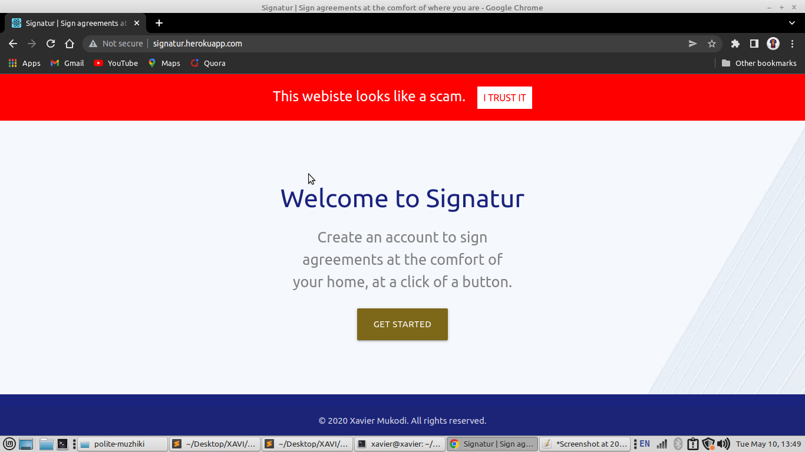

# Anti-phishing google chrome extension

This project is a tool to fight scam websites. It is a browser extension (for Chrome only so far). It works by detecting the URL in the URL bar, then send the URL to the backend for analysis. If the URL is flagged to be malicious, the extension will inject HTML to the page warning the user as shown below.

